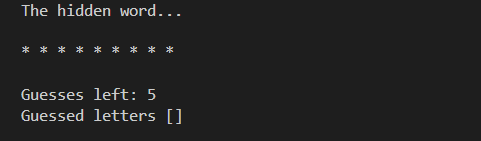
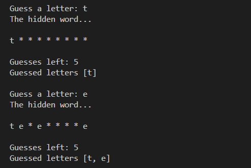
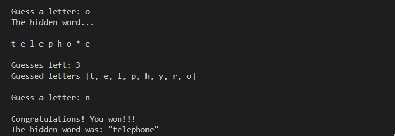

# Hangman

This is a simple text-based Hangman game written in Java for the "Programming 2 (811322A) -course. We essentially have the every child's favorite morbid guessing game where the player tries to guess a predetermined word within a certain number of guesses. But this time not on the chalk board but in confines of your console window.  


## Description

 * The gameplay is that of the classic hangman game. The computer chooses a word at random from a list and keeps it hidden from the player, revealing only the the number of letters indicated by asterisks. The player tries to guess the letters of the word one letter at a time. The number of guesses is limited. You win the game by guessing all the letters within the allowed number of attempts. If you exceed that limit, you lose.
 
 <p align="center">
  
</p>

 * Once the game is ran you are introduced to a screen as shown above in the command-line interface of your choosing. 
 * The game will randomly select a word from those listed in the `words.txt` file. You can modify this list to include any words you like. Naturally, if only one word is provided that is the one picked every single time. The word, in this instance *telephone*, is shown with each letter being replaced by an asterisk as not to reveal the word but to only indicate the length of the word. 
 * The number of guesses is also shown which is 5. This is the default value but it can be manually tweaked to your liking in `Main.java` file. 
 * Within the square brackets is the list of all letters you have already guessed up to that point. At the beginning the brackets are empty but will fill up with your guesses as you play. Incorrect guesses are also listed here but will not reveal new letters from the shown word. 
 * If an incorrect guess is made, the number of guesses remaining is reduced by one.


<p align="center">

</p>

* When a letter that appears in the chosen word is guessed correctly, any asterisks representing that letter are replaced and added to the list of guessed letters, as shown above.
* If all of the words are guessed correctly within the set number of guesses, you win the game. This scenario is shown below.

<p align="center">

</p>

* When you have guessed all of the letters correctly you will be congratulated on your incredible feat and shown what the hidden word was. 

That is all there is to it! Now we can get to the fun part and download the game for ourselves.

## Getting Started

The relevant files to run the project are `Hangman.java`, `Main.java`, `WordList.java`. 
### Prerequisites

To run this project, you'll need:
- Java (JDK 8 or higher)
- A terminal or command prompt

### How to Run

1. Clone this repository:
   ```bash
   git clone https://github.com/Sahe00/hangman-JAVA.git
2. Locate the directory:
    ```
    homework4\src\main\java>
3. To compile:
    ```bash
    javac .\dev\m3s\programming2\homework4\*.java
4. Then run:
    ```bash
    java .\dev\m3s\programming2\homework4\Main.java
    ```

And you should be done!